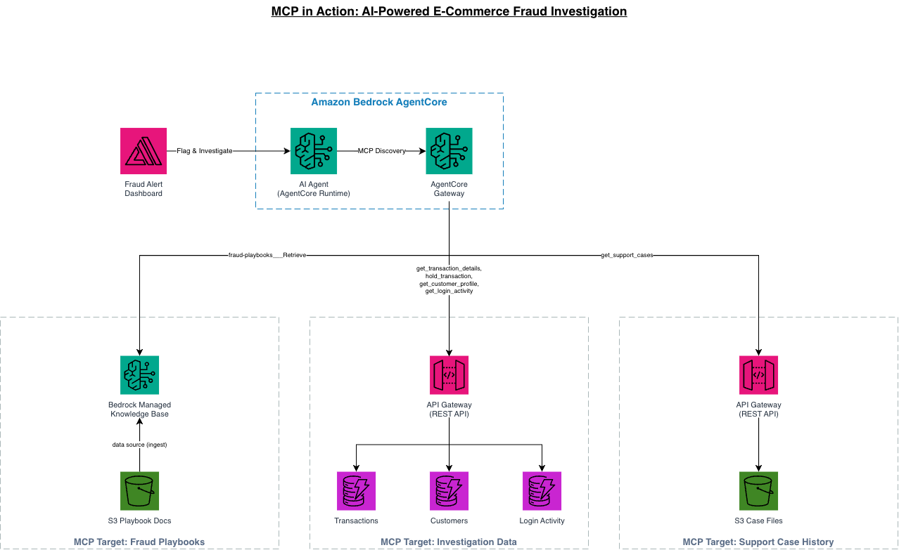

# Sample: MCP in Action, an AI-Powered E-Commerce Fraud Investigation Agent

> This is a sample for education and demonstration. It is not intended for
> production use. Deploy it in a sandbox AWS account, in **us-west-2 only**, and
> tear it down when you are finished. See [SECURITY.md](SECURITY.md).

An end-to-end sample that shows the Model Context Protocol (MCP) doing real
work. A Strands SDK agent runs on Amazon Bedrock AgentCore, connects to an
AgentCore Gateway over MCP, and investigates a suspected e-commerce fraud case
by pulling from simulated data sources: transaction history, customer profiles,
login activity, prior support cases, and a knowledge base of fraud playbooks.
A React dashboard (hosted on AWS Amplify) streams the agent's reasoning back to
you token by token as it works the case.

The whole thing deploys from one script and is ready to use out of the box. The
seed data and the built dashboard ship prebuilt in `assets/seed-bundle.zip`, so
you do not have to build anything to try it. The source for the agent, the
dashboard, and the seed data is also in `assets/` so you can read exactly how it
works and rebuild the bundle yourself.

## Demo


## The story

Fraud analysts do not lack data, they lack time. A single "is this charge
legitimate?" question means opening five tools: the transaction ledger, the
customer's profile and history, recent login and device activity, the support
case trail, and the internal playbooks that say what "suspicious" actually
means for your business. Stitching that together by hand, per case, is slow.

This sample hands that job to an agent. You give it a customer ID or a
transaction, and it decides which sources to consult, queries them through MCP
tools, checks the behavior against the fraud playbooks, and returns a reasoned
verdict with the evidence it used. You watch it think in real time in the
dashboard. Nothing here is a black box: every tool the agent can call maps to a
concrete AWS integration you can inspect in the template.

## Architecture



**Flow:** you sign in to the Amplify dashboard with a Cognito user. The
dashboard calls the AgentCore Runtime directly over an authenticated,
server-sent-events (SSE) stream, so the agent's output renders live. The Strands
agent in the Runtime connects to an AgentCore Gateway that exposes three MCP
targets. Two of those targets are API Gateway REST APIs wired straight to data
with no Lambda in the path: one does a direct DynamoDB integration for
structured records (transactions, customer profiles, login activity), the other
does a direct S3 integration for support-case files. The third target is a
Bedrock Managed Knowledge Base built from the fraud playbooks, so the agent can
retrieve policy guidance in natural language. There is zero Lambda in the
runtime request path.

## How it works

| Layer | Service | Role in the sample |
|-------|---------|--------------------|
| Frontend | AWS Amplify (React) | Dashboard that streams the investigation live |
| Auth | Amazon Cognito | User pool that issues the JWT the dashboard and Runtime use |
| Agent runtime | Amazon Bedrock AgentCore Runtime | Hosts the Strands SDK agent, streams over SSE, validates JWT |
| Tool layer | Amazon Bedrock AgentCore Gateway | Exposes three MCP targets to the agent |
| Structured data | Amazon API Gateway to Amazon DynamoDB (direct integration) | Transactions, customer profiles, login activity |
| Documents | Amazon API Gateway to Amazon S3 (direct integration) | Support-case files |
| Knowledge | Amazon Bedrock Managed Knowledge Base | Fraud playbooks, retrieved by the agent |
| Model | Amazon Bedrock (Claude Sonnet 4.6 by default) | Reasoning model for the agent |
| Embeddings | Amazon Titan Text Embeddings v2 | Vectorizes the playbooks for the knowledge base |

The agent, its Dockerfile, and its dependencies are in `assets/agent/`. The
dashboard source is in `assets/dashboard/`. The seed data (the DynamoDB records,
the support cases, and the playbook text) is in `assets/seed-data/`.

## Prerequisites

- Credentials for a **sandbox AWS account**, and you must deploy in **us-west-2**
  (the template enforces this with a stack rule and will refuse other regions).
- **AWS CLI v2**, configured for that account.
- **Amazon Bedrock model access** granted in us-west-2 for both:
  - Anthropic Claude Sonnet 4.6 (`us.anthropic.claude-sonnet-4-6`)
  - Amazon Titan Text Embeddings v2 (`amazon.titan-embed-text-v2:0`)
  - Request access in the Bedrock console under Model access if you have not
    already. Deployment will fail at the knowledge-base or agent step without it.
- **Node.js 18+** and **npm**, only if you want to rebuild the seed bundle from
  source with `scripts/build-bundle.sh`. You do not need Node.js just to deploy,
  the prebuilt bundle is already in the repo.

## Deploy (one command, about 15 to 20 minutes)

Run from the repository root. The script creates (or reuses) an S3 bucket in
us-west-2, uploads `assets/seed-bundle.zip` to it, and deploys the
CloudFormation template. Deployment takes 15 to 20 minutes because it builds an
ARM container image in CodeBuild, stands up the AgentCore Runtime, ingests the
knowledge base, and publishes the Amplify app.

```bash
chmod +x scripts/*.sh
./scripts/deploy.sh
```

When it finishes it prints three outputs:

1. **FraudDashboardURL**: open this in your browser.
2. **WorkshopUsername**: the login email (`fraud-admin@workshop.aws` by default).
3. **WorkshopPasswordSecret**: the Secrets Manager secret that holds the
   generated password. Read it with:
   ```bash
   aws secretsmanager get-secret-value \
     --secret-id <the-secret-name-from-the-output> \
     --region us-west-2 \
     --query SecretString --output text
   ```

The bucket name and region can be overridden with environment variables:

```bash
REGION=us-west-2 BUCKET=my-fraud-assets-bucket ./scripts/deploy.sh
```

## Using it

1. Open **FraudDashboardURL** and sign in with the username and the password you
   read from Secrets Manager.
2. Start an investigation from the dashboard (for example, ask it to review a
   flagged customer or transaction from the seed data).
3. Watch the agent stream its reasoning: it decides which MCP tools to call,
   pulls transactions, profiles, and login activity, reads the relevant support
   cases, checks the fraud playbooks, and returns a verdict with the evidence.

The `assets/agent/fraud-agent-lab.ipynb` notebook walks through the same agent
step by step if you want to drive it directly rather than through the dashboard.

## Rebuild the seed bundle (optional)

The repo already contains a prebuilt `assets/seed-bundle.zip`. If you change the
dashboard, the seed data, or the notebook, regenerate the bundle:

```bash
./scripts/build-bundle.sh
```

This runs `npm ci` and `npm run build` in `assets/dashboard/`, zips the build
output, and assembles the seed data, the dashboard build, and the notebook into
a fresh `assets/seed-bundle.zip`. Then run `./scripts/deploy.sh` again.

## Repository structure

```
.
├── cloudformation/
│   └── mcp-fraud-lab.yaml        # the full stack (single template)
├── assets/
│   ├── agent/                    # Strands agent source, Dockerfile, notebook
│   ├── dashboard/                # React dashboard source
│   ├── seed-data/                # transactions, profiles, logins, cases, playbooks
│   └── seed-bundle.zip           # prebuilt bundle the stack self-loads on deploy
├── scripts/
│   ├── deploy.sh                 # create bucket, upload bundle, deploy stack
│   ├── build-bundle.sh           # rebuild seed-bundle.zip from source
│   └── teardown.sh               # delete the stack and clean up
├── docs/
│   └── architecture.png
├── README.md
├── SECURITY.md
├── CONTRIBUTING.md
├── CODE_OF_CONDUCT.md
├── THIRD-PARTY-LICENSES
└── LICENSE
```

## Cost

This stack runs paid resources: AgentCore Runtime, a Bedrock Managed Knowledge
Base (with an OpenSearch Serverless collection behind it), DynamoDB, S3, API
Gateway, Cognito, Amplify, a KMS key, and Bedrock model invocations while you
use the agent. Treat it as a short-lived demo, not something to leave running.
Costs stop when you tear it down.

## Cleanup

```bash
./scripts/teardown.sh
```

This deletes the CloudFormation stack and waits for completion. Pass
`DELETE_BUCKET=true` to also empty and delete the assets bucket the deploy
script created.

## Security

This is a demonstration sample. It is not hardened for production and should
only run in a disposable sandbox account. See [SECURITY.md](SECURITY.md) for
the security notes and how to report a genuine issue.

## License

This sample is licensed under the MIT-0 License. See [LICENSE](LICENSE).
Third-party dependency attributions are in
[THIRD-PARTY-LICENSES](THIRD-PARTY-LICENSES).
